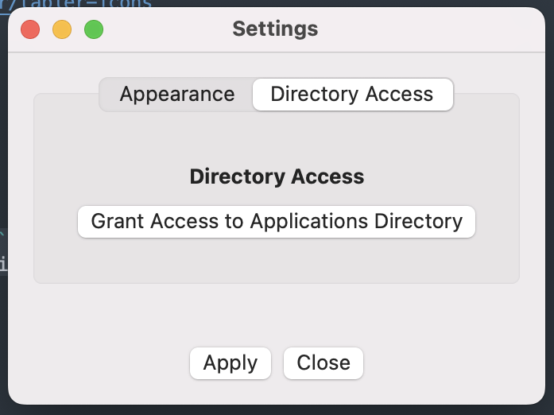

========
app-menu
========
.. Internal references

.. _Releases: https://github.com/barseghyanartur/app-menu/releases/

.. External references

.. _tabler icons: https://github.com/tabler/tabler-icons

The missing Applications Menu for macOS.

.. image:: Docs/app_menu_screenshot.jpg
  :width: 400
  :alt: AppMenu screenshot

Compatibility
=============
- macOS Sequoia (15.x)
- macOS Sanoma (14.x)
- macOS Ventura (13.x)

Installation
============
Install using ``brew``
----------------------
*Recommended*

.. code-block:: sh

    brew tap barseghyanartur/app-menu-tap
    brew install --cask app-menu

Install manually
----------------
Go to `Releases`_ and download the latest ``ApplicationMenu.zip`` file, 
unpack it, open the extracted ``ApplicationMenu.dmg`` and simply drag the 
``ApplicationMenu`` into the ``Applications`` directory.

.. image:: Docs/app_menu_installation.jpg
  :width: 400
  :alt: AppMenu installation

Configuration
=============
By default, Application Menu does not have access to user specific 
``Applications`` directory (located in the ``~/Applications``). In order to 
be able to list those applications in the Application Menu, you will need to 
grant access to mentioned directory. That can be done in the application 
``Settings``, as shown below:

After you have granted the access, make sure to refresh the applications list
(click on the ``Refresh`` item in the menu).

Credits
=======
The application icon has been taken from the amazing `tabler icons`_ 
(``MIT`` licensed).

License
=======
MIT

Support
=======
For security issues contact me at the e-mail given in the `Author`_ section.

For overall issues, go to `GitHub <https://github.com/barseghyanartur/app-menu/issues>`_.

Author
======
Artur Barseghyan <artur.barseghyan@gmail.com>
