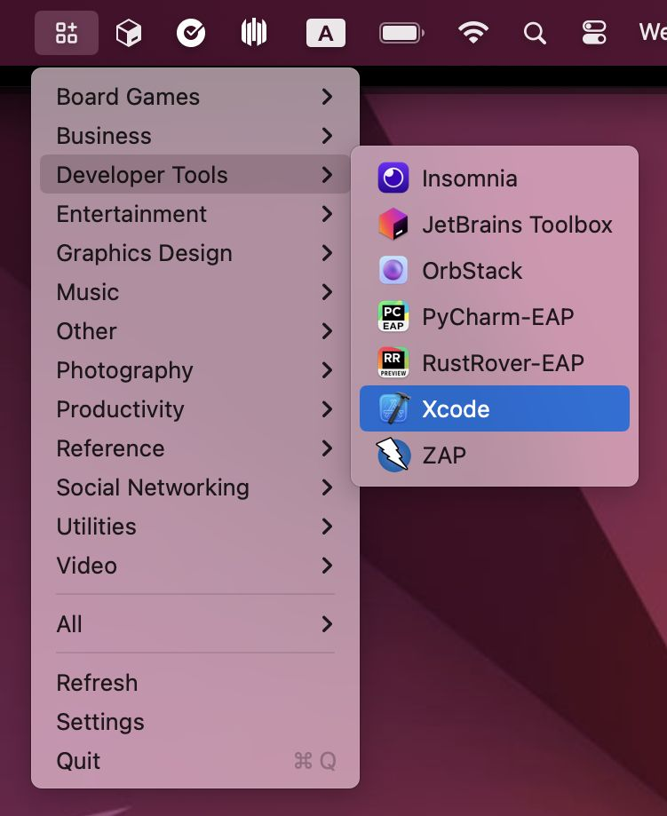
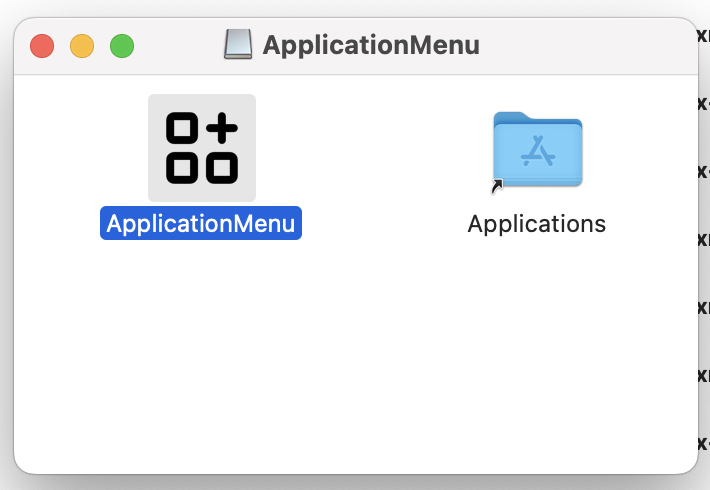

========
app-menu
========
.. Internal references

.. _Releases: https://github.com/barseghyanartur/app-menu/releases/

.. External references

.. _tabler icons: https://github.com/tabler/tabler-icons

The missing Application Menu for macOs.

Installation
============
Go to `Releases`_ and download the latest ``ApplicationMenu.dmg`` file, 
double click it and simply drag the ``ApplicationMenu`` into the 
``Applications`` directory.

Credits
=======
The application icon has been taken from the amazing `tabler icons`_ 
(``MIT`` licensed).

License
=======
MIT

Support
=======
For security issues contact me at the e-mail given in the `Author`_ section.

For overall issues, go to `GitHub <https://github.com/barseghyanartur/app-manu/issues>`_.

Author
======
Artur Barseghyan <artur.barseghyan@gmail.com>
